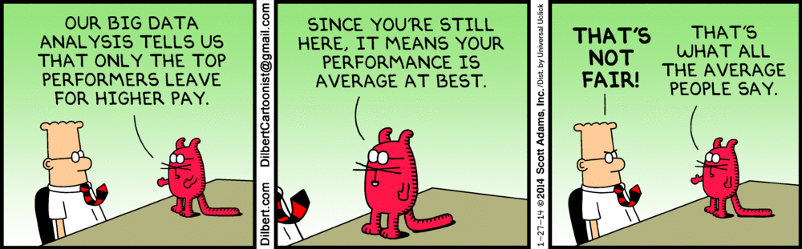

---
title: "Disparities of Personal Income"
subtitle: 'Invesitgation of the affects of Location, Age, Sex, Race, Workhours and Travel Time on Personal Income'
author: "Team:Keep Calm and Restart R"
date: "February 2, 2016"
output: html_document
--- 
Throughout this report we will investigate many parameters on income. We are utilizing the American Community Survey (ACS), which was conducted to represent approximately 3.5 million households per year. Here we will investigate the specific attributes of Location, Race,Sex,Work Hours,Travel Time to Work and their affects on Person's Total Income. We will show patters observed along with several conclusions from the data. 

<div style="text-align: center;"></div>


```{r, echo=FALSE, warning = FALSE, message=FALSE}
library(rgl)
library(knitr)
#knit_hooks$set(webgl = hook_webgl)
library(grid)
library(gridExtra)
library(Rmisc)
library(sitools)
library(hexbin)
library(dplyr)
library(data.table)
library(googleVis)
library(ggplot2)
library(RColorBrewer)
library(survey)

op <- options(gvis.plot.tag='chart')
```

```{r, echo=FALSE, warning = FALSE, message = FALSE}
#set local working directory

#setwd("~/Downloads/2013-american-community-survey/pums")
setwd("/Users/bobminnich/Documents/Columbia/Courses/Applied_Data_Science/Data/")


# read .csv files and make complete datasets

pdata1 <- fread("ss13pusa.csv", showProgress = FALSE)
pdata2 <- fread("ss13pusb.csv", showProgress = FALSE)
pus <- rbind(pdata1, pdata2)
```

```{r, echo=FALSE}
# select needed variables
income <- select(pus, ADJINC, WAGP, PWGTP,PINCP,ST)

# adjust PINCP by ADJINC and create a new column called real for it
income$real <- as.numeric(income$ADJINC) * 10^(-6)* as.numeric(income$PINCP)

# match ST in income data set to statenames in ST.anno
income<- tbl_df(income) 
ST.anno<-read.csv("statenames.csv")
income <- inner_join(income, ST.anno, by = c("ST" = "code"))

# select adjusted total person income and statename from income dataset
income2<-select(income,real,name)

# remove all missing values
income3 <- subset(income2, !is.na(real))

# calculate average adjusted PINCP according to state
meanincome<-aggregate(real~name, data=income3, FUN=function(income3) c(mean=mean(income3), count=length(income3)))
```
###Average Total Person Income according to States of Residence
```{r,results='asis',tidy=FALSE, echo = FALSE, fig.align='center'}
meanincome$use = meanincome$real[,1]
GeoStates <- gvisGeoChart(meanincome, "name", "use",
                          options=list(region="US", 
                                       displayMode="regions", 
                                       resolution="provinces",
                                       width=600, height=400))
plot(GeoStates)
```


```{r, echo=FALSE}
# select needed variables
relation <- select(pus, POBP,ST, ADJINC, PINCP)

# match ST in relation data set to actual statenames in ST.anno
relation<- tbl_df(relation) 
relation <- inner_join(relation, ST.anno, by = c("POBP" = "code"))

# adjust PINCP by ADJINC and create a new column called real for it in relation dataset
relation$realpobp <- as.numeric(relation$ADJINC) * 10^(-6) * as.numeric(relation$PINCP)

# select adjusted total person income and statename from relation dataset
relation2<-select(relation,realpobp,name)

# remove all missing values
relation3 <- subset(relation2, !is.na(realpobp))

# calculate average adjusted PINCP according to individual's birthplace 
meanincomepobp<-aggregate(realpobp~name, data=relation3, FUN=function(relation3) c(mean=mean(relation3), count=length(relation3)))
```

###Average Total Person Income according to Birthplace
```{r,results='asis',tidy=FALSE, echo=FALSE, fig.align='center'}
meanincomepobp$usepobp = meanincomepobp$realpobp[,1]
GeoStates2 <- gvisGeoChart(meanincomepobp, "name", "usepobp",
                          options=list(region="US", 
                                       displayMode="regions", 
                                       resolution="provinces",
                                       width=600, height=400))
plot(GeoStates2)
```

People live in District of Columbia have the highest average total person income. It is then followed by people from Connecticut, Maryland, New Jersey and Massachusetts. 
The similar pattern can be found in the plot of average total person income according to birthplace except that Maryland is replace by New York and it moves one place up the list. District of Columbia still tops the list. 
In general, people born in the following five places, District of Columbia, Connecticut, Maryland, New York, Massachusetts, are also those who have highest average total person income in adulthoods.

How does gender influence income?

```{r, echo=FALSE, fig.align='center'}
# Collect variables
income.sex <- as.data.frame(cbind(income$real, pus$SEX))
colnames(income.sex) <- c("income", "sex")
income.sex <- income.sex[which(income.sex$income > 0), ]

# Visualize from a density perspective
dmale <- density(log10(income.sex[income.sex$sex == 1, ]$income))
dfemale <- density(log10(income.sex[income.sex$sex == 2, ]$income))
plot(dmale, main = "The effect of sex on income", col.main = "darkred", xlab = "income (log10 scale)")
polygon(dmale, col = "#00BFFF55", border = "#00BFFF", lwd = 2)
polygon(dfemale, col = "#00CD0055", border = "#00CD00",lwd = 2)
abline(v=seq(-2, 7, by = 1), col = "grey", lty = 2)
legend("topleft", legend = c("Male", "Female"), fill = c("#00BFFF", "#00CD00"), cex = 1.1, bg = "white")
```

##### From the plot, we can see that: 
##### - 1. both density distributions of males' income and females' income are left-skewed and have a long tail. 
##### - 2. There are more fluctuations in females' income.
##### - 3. Generally speaking, males have higher income than females. 

### How does age influence income?

```{r, echo=FALSE, warning = FALSE, message=FALSE, fig.align='center'}
# Collect variables
income.age <- as.data.frame(cbind(income$real, pus$AGEP))
colnames(income.age) <- c("income", "age")
income.age <- income.age[which(income.age$income > 0), ]
income.age$age <- as.numeric(income.age$age)
income.age <- income.age[which(income.age$age >= 18), ]

# Visualize from a density perspective
dyouth <- density(log10(income.age[income.age$age >= 18 & income.age$age < 24, ]$income))

dmiddle <- density(log10(income.age[income.age$age >= 24 & income.age$age < 45, ]$income))

dmiddle_aged <- density(log10(income.age[income.age$age >= 45 & income.age$age < 65, ]$income))

daged <- density(log10(income.age[income.age$age >= 65, ]$income))

plot(dmiddle, main = "The effect of age on income", col.main = "darkred", xlab = "income (log10 scale)")

polygon(dyouth, col = "#00BFFF55", border = "#00BFFF", lwd = 2)
polygon(dmiddle, col = "#00CD0055", border = "#00CD00",lwd = 2)
polygon(dmiddle_aged, col = "#FB807255", border = "#FB8072",lwd = 2)
polygon(daged, col = "#FDB46255", border = "#FDB462",lwd = 2)

abline(v=seq(-2, 7, by = 1), col = "grey", lty = 2)
abline(v = mean(dyouth, rm.na = T), col = "red", lty = 2)
legend("topleft", legend = c("18-24 years old", "24-45 years old", "45-65 years old", "above 65 years old"), fill = c("#00BFFF", "#00CD00", "#FB8072", "#FDB462"), cex = 1.1, bg = "white")
```

- 1. The density function of people aged 18-24 years old has the lowest peak value and widest distribution, while the other three are more centered.
- 2. The density functions of people aged 24-45 years old and aged 45-65 years old are similar.  
- 3. People aged 24-45 years old and aged 45-65 years old have higher income than others.

Then we draw a boxplot to show the income of every age. 

```{r, fig.width = 12, fig.height = 4.5, echo=FALSE}
# Visualize from boxplot.
boxplot(log10(income.age$income) ~ income.age$age, col="#00BFFF40", main = "Age by income", col.main="darkred", xlab = "age", ylab= "income (log10 scale)", outline=FALSE, cex.axis=0.7, las=2, varwidth=T, border="darkslateblue")
```

We see things are similar with the previous plot. 

### How does disability and Degree Field affect Personal Income?

Degree Field

```{r,results='asis',tidy=FALSE, echo=FALSE, fig.align='left'}

popul_simp=select(pus, PINCP,FOD1P)
populfod1 <-popul_simp %>%
  na.omit() %>%
  group_by(FOD1P) %>% 
  mutate(meanIncome = mean(PINCP))
head(populfod1$meanIncome)

fod=distinct(select(populfod1, FOD1P,meanIncome))
fod$xaxis=seq(1,173)

library(googleVis)

Bubble <- gvisBubbleChart(fod, idvar = "FOD1P", xvar = "xaxis", 
                          yvar = "meanIncome", 
                          colorvar = "meanIncome", sizevar = "meanIncome", 
                          chartid = "Bubble_Chart", options = list(colorAxis = "{colors: ['lightblue', 'blue']}", 
                          vAxis = "{title:'Mean Income'}", hAxis = "{title:'First Entry'}", 
                         width = 1000, height = 1000, bubble = "{textStyle:{color: 'blue',fontName: 'Times-Roman', fontSize:9}}",                                                                    explorer = "{actions: ['dragToZoom', 'rightClickToReset'] }",
                         title = "Mean Income Bubble Chart"))
plot(Bubble)
```


Next is about disability

```{r,results='asis',tidy=FALSE, echo=FALSE, fig.align='center'}

DIS=select(pus, PINCP,DIS)

#Check for NAs
na.check = DIS%>%
  is.na() %>%
  apply(2,sum)

#Calculate % of NA
percentDIS = na.check/nrow(DIS)
percentDIS 

dis.na<-DIS %>%
  na.omit() %>%
  group_by(DIS) %>% 
  mutate(meanIncome = mean(PINCP))

dischart=distinct(select(dis.na, DIS,meanIncome))
head(dischart)
dischart$legend=c("Without a disbility", "With a disbility")

ggplot(data=dischart, aes(x=legend, y=meanIncome, fill=DIS)) + 
  geom_bar(colour="black", fill="#DD8888", width=.5, stat="identity") + 
  guides(fill=FALSE) +
  xlab("Disability") + ylab("Mean Income") +
  ggtitle("Income difference")
```
<br />

So we can see people with out a disbility can eran much more than those with a disability

```{r, echo=FALSE}
#Select Specific Columns
pus_work <- select(pus,JWMNP,WKHP,JWDP,JWAP,PINCP,SEX,RAC1P,PWGTP)
pus_work <- cbind(pus_work, data.frame(pus)[,204:283])
#remove NAs for PINCP and JWMNP
na.hrs = which(!(is.na(pus_work$JWMNP)+is.na(pus_work$PINCP)))
pwork_hrs = data.frame(pus_work[na.hrs,])

```

```{r, echo=FALSE}
df = data.frame(pwork_hrs)
#add in Weight Columns
df$RAC1P = factor(df$RAC1P)
df$SEX = factor(df$SEX)


acsdesign<-svrepdesign(weights= ~PWGTP, repweights=df[,9:88], type="BRR", rscale = 4/80,data=df, combined=TRUE)

WKHP_mean = svymean(~WKHP, acsdesign, na.rm=T)
WKHP_quant = svyquantile(~WKHP, acsdesign, c(.25,.5,.75), na.rm=T)
            
JWMNP_mean = svymean(~JWMNP, acsdesign, na.rm=T)
JWMNP_quant = svyquantile(~JWMNP, acsdesign, c(.25,.5,.75), na.rm=T)

real_mean = svymean(~PINCP, acsdesign, na.rm=T)
real_quant = svyquantile(~PINCP, acsdesign, c(.25,.5,.75), na.rm=T)


newdf = data.frame(matrix(rep(0,length(unique(df$RAC1P))*13),nrow = length(unique(df$RAC1P)), ncol = 13) )
colnames(newdf) = c("RAC1P", "PINCP_Mean", "PINCP_25Q", "PINCP_50Q", "PINCP_75Q", "JWMNP_Mean", "JWMNP_25Q", "JWMNP_50Q", "JWMNP_75Q", "WKHP_Mean", "WKHP_25Q", "WKHP_50Q", "WKHP_75Q")

for(i in c(1:length(unique(df$RAC1P)))){
#for(i in c(1:2)){
  ndf = filter(df,RAC1P == i)
  acsdesign_filter<-svrepdesign(weights= ~PWGTP, repweights=ndf[,9:88], type="BRR", rscale = 4/80,data=ndf,combined=TRUE)
  
  PINCP_mean = svymean(~PINCP, acsdesign_filter, na.rm=T)
  PINCP_quant = svyquantile(~PINCP, acsdesign_filter, c(.25,.5,.75), na.rm=T)
  newdf[i,2] = PINCP_mean[1]
  newdf[i,3:5] = PINCP_quant[1:3]
  
  JWMNP_mean_2 = svymean(~JWMNP, acsdesign_filter, na.rm=T)
  JWMNP_quant_2 = svyquantile(~JWMNP, acsdesign_filter, c(.25,.5,.75), na.rm=T)
  newdf[i,6] = JWMNP_mean_2[1]
  newdf[i,7:9] = JWMNP_quant_2[1:3]

  WKHP_mean_2 = svymean(~WKHP, acsdesign_filter, na.rm=T)
  WKHP_quant_2 = svyquantile(~WKHP, acsdesign_filter, c(.25,.5,.75), na.rm=T)
  newdf[i,10] = WKHP_mean_2[1]
  newdf[i,11:13] = WKHP_quant_2[1:3]
}
```

###Density Plots of Minutes of Travel to Work, Work Hours Per Week and Personal Income

Here we will look at many density plots for comparsions between races and the total population. On the race plots you will see "Pop" markders, which idenfiy the Median for the overall population. Where we see "Race" signifies the median of that particular race.

```{r warning = FALSE, fig.align='center', echo=FALSE, fig.width=12}

races = c("White","Black","American  Indian","Alaska Native","American and Alaskan ","Asian","Native Hawaiian","Some Other Alone", "Two or More")
races_num = c(1:9)

pwork_hrs$SEX_T[pwork_hrs$SEX == 1] = "M"
pwork_hrs$SEX_T[pwork_hrs$SEX == 2] = "F"

popcolor = "blue"
##########Plot Main###############################
MainTitle = ("Density Plots Male (Blue) vs Female (Red) - Total Poplation")
plot_df = pwork_hrs
  main1 = ggplot(plot_df, aes(x=JWMNP,fill=factor(SEX_T),weights=PWGTP/sum(PWGTP))) +
    geom_density(alpha=.4, adjust = 2,aes(weights=PWGTP/sum(PWGTP))) + 
    xlab("Minutes of Travel to Work") + 
    ylab("Density") +
    xlim(0,75) + 
    guides(fill=FALSE) + 
    geom_vline(xintercept = JWMNP_quant_2[2],colour="black",linetype = "longdash") +  
    annotate("text", x = JWMNP_quant_2[2], y = 0, label = "50%", vjust = 1.25, hjust = 1 )+
    annotate("text", x = JWMNP_quant_2[2], y = 0, label = "Pop", vjust = -0.25, hjust = 1, color = "white")+
    geom_vline(xintercept = JWMNP_mean_2[1], color = "black") + 
    annotate("text", x = JWMNP_mean_2[1], y = 0, label = "Pop", vjust = -0.25, hjust = 0, color = "white") +
    annotate("text", x = JWMNP_mean_2[1], y = 0, label = "Mean", vjust = 1.25, hjust = 0, color = "black") 

  #Work Hours per Week
  main2 = ggplot(plot_df, aes(x=WKHP, fill=factor(SEX_T),weights=PWGTP/sum(PWGTP))) +
    geom_density(alpha=.4, adjust = 2,aes(weights=PWGTP/sum(PWGTP))) +
    xlim(0,80) + xlab("Work Hours Per Week") + 
    guides(fill=FALSE)+ 
    theme(axis.title.y = element_blank()) + 
    #ylim(0,0.1)+
    geom_vline(xintercept = WKHP_quant_2[2],colour="black",linetype = "longdash") +  
    annotate("text", x = WKHP_quant_2[2], y = .09, label = "50%", vjust = 0, hjust = 0 )+
    annotate("text", x = WKHP_quant_2[2], y = .09, label = "Pop", vjust = -1.25, hjust = 0)+
    
    geom_vline(xintercept = WKHP_mean_2[1], color = "black") + 
    annotate("text", x = WKHP_mean_2[1], y = .1, label = "Mean", vjust = 0, hjust = 1, color = "black")+
    annotate("text", x = WKHP_mean_2[1], y = .1, label = "Pop", vjust = -1.25, hjust = 1, color = "black") 
#-37.50,-37.50
  #Personal Income
  main3 = ggplot(plot_df, aes(x=PINCP, fill=factor(SEX_T),weights=PWGTP/sum(PWGTP))) +
    xlab("Personal Income")+ 
    theme(axis.title.y = element_blank())+
    geom_density(alpha=.4,adjust=2,aes(weights=PWGTP/sum(PWGTP))) +
    labs(fill = "Sex")+  
    scale_x_continuous(labels=f2si, limits = c(0,200000))   + 
    guides(fill=FALSE) +
    geom_vline(xintercept = real_quant[2],colour="black",linetype = "longdash") +  
    annotate("text", x = real_quant[2], y = 0, label = "50%", vjust = 1.25, hjust = 1 )+
    annotate("text", x = real_quant[2], y = 0, label = "Pop", vjust = -0.25, hjust = 1, color = "white")+
    geom_vline(xintercept = real_mean[1],colour="black") +  
    annotate("text", x = real_mean[1], y = 0, label = "Pop", vjust = -0.25, hjust = 0, color = "white")+
    annotate("text", x = real_mean[1], y = 0, label = "Mean", vjust = 1.25, hjust = 0, color = "black")

  grid.newpage()
  pushViewport(viewport(layout = grid.layout(2, 3, heights = unit(c(0.5, 5), "null"))))
  grid.text(MainTitle, vp = viewport(layout.pos.row = 1, layout.pos.col = 1:3))
  print(main1, vp = viewport(layout.pos.row = 2, layout.pos.col = 1),newpage=FALSE)
  print(main2, vp = viewport(layout.pos.row = 2, layout.pos.col = 2),newpage=FALSE)
  print(main3, vp = viewport(layout.pos.row = 2, layout.pos.col = 3),newpage=FALSE)
  popViewport(1)


##########Plot Races###############################

for (i in seq(1,9,1)){
  MainTitle = paste("Density Plots Male (Blue) vs Female (Red) - ", races[i])
  plot_df = filter(pwork_hrs, RAC1P == i)

    #Travel time to work
  a = ggplot(plot_df, aes(x=JWMNP,fill=factor(SEX_T),weights=PWGTP/sum(PWGTP))) +
    geom_density(alpha=.4, adjust = 2,aes(weights=PWGTP/sum(PWGTP))) + 
    xlab("Minutes of Travel to Work") + 
    ylab("Density") +
    xlim(0,75) + 
    guides(fill=FALSE) + 
    
    geom_vline(xintercept = JWMNP_quant_2[2],colour="black",linetype = "longdash") +  
    annotate("text", x = JWMNP_quant_2[2], y = 0, label = "50%", vjust = 1.25, hjust = 0 )+
    annotate("text", x = JWMNP_quant_2[2], y = 0, label = "Pop ", vjust = -0.25, hjust = 0, color = "white")+

    geom_vline(xintercept = newdf[i,8], color = popcolor) + 
    annotate("text", x = newdf[i,8], y = 0, label = "50%", vjust = -2.5, hjust = 0, color = popcolor ) + 
    annotate("text", x = newdf[i,8], y = 0, label = "Race", vjust = -4, hjust = 0, color = popcolor )

  #Work Hours per Week
  b = ggplot(plot_df, aes(x=WKHP, fill=factor(SEX_T),weights=PWGTP/sum(PWGTP))) +
    geom_density(alpha=.4, adjust = 2,aes(weights=PWGTP/sum(PWGTP))) +
    xlim(0,80) + xlab("Work Hours Per Week") + 
    guides(fill=FALSE)+ 
    theme(axis.title.y = element_blank()) + 
    ylim(0,0.1)+
    geom_vline(xintercept = WKHP_quant_2[2],colour="black",linetype = "longdash") +  
    annotate("text", x = WKHP_quant_2[2], y = 0, label = "50%", vjust = 1.25, hjust = -0.1 )+
    annotate("text", x = WKHP_quant_2[2], y = 0, label = "Pop", vjust = 1.25, hjust = 1.1)+

    geom_vline(xintercept = newdf[i,12], color = popcolor) + 
    annotate("text", x = newdf[i,12], y = .08, label = "50%", vjust = 0, hjust = 0, color = popcolor ) + 
    annotate("text", x = newdf[i,12], y = .08, label = "Race", vjust = -1.25, hjust = 0, color = popcolor )
      

  #Personal Income
  c = ggplot(plot_df, aes(x=PINCP, fill=factor(SEX_T),weights=PWGTP/sum(PWGTP))) +
    xlab("Personal Income")+ 
    theme(axis.title.y = element_blank())+
    geom_density(alpha=.4,adjust=2,aes(weights=PWGTP/sum(PWGTP))) +
    labs(fill = "Sex")+  
    scale_x_continuous(labels=f2si, limits = c(0,200000))   + 
    guides(fill=FALSE) +

    geom_vline(xintercept = real_quant[2],colour="black",linetype = "longdash") +  
    annotate("text", x = real_quant[2], y = 0, label = "50%", vjust = 1.25, hjust = 0 )+
    annotate("text", x = real_quant[2], y = 0, label = "Pop", vjust = -0.25, hjust = 0, color = "white")+

    geom_vline(xintercept = newdf[i,4], color = popcolor) + 
    annotate("text", x = newdf[i,4], y = 0, label = "50%", vjust = -3, hjust = 0, color = popcolor ) + 
    annotate("text", x = newdf[i,4], y = 0, label = "Race", vjust = -4.25, hjust = 0, color = popcolor )


  grid.newpage()
  pushViewport(viewport(layout = grid.layout(2, 3, heights = unit(c(0.5, 5), "null"))))
  grid.text(MainTitle, vp = viewport(layout.pos.row = 1, layout.pos.col = 1:3))
  print(a, vp = viewport(layout.pos.row = 2, layout.pos.col = 1),newpage=FALSE)
  print(b, vp = viewport(layout.pos.row = 2, layout.pos.col = 2),newpage=FALSE)
  print(c, vp = viewport(layout.pos.row = 2, layout.pos.col = 3),newpage=FALSE)
  popViewport(1)
}
```
<br />

Overall the plots help show the differences between the Population Median and each Race Median. This can give us an idea of what we can expect to see in the linear regression in terms of correlations between Race,Sex,Work Hours,Travel Time to Work and a Person's Total Income.

While the Work Hours Per Week are very consistent, there are differences between Races in Travel Time to Work. Native Americans and Alaskans were well below hte Population Median. This could be a potential relatioship between living on reservations or in isolated areas, where work is mostly local. The Asian population however traveled farther to work that the US Population Median.

In terms of Total Personal Income all of the races were less than the US Population Median, except White and Asian.

We can also see from the plots the differences in Sex between racial populations. One interesting observation is that there is a certain point in almost all races of the Personal Income, where to the left of the point, Female density is higher. Everything to the right of that same point, the Male density is higher.

###Linear Regression Analysis of Race,Sex,Work Hours,Travel Time to Work on a Person's Total Income

```{r eval = FALSE}
summary(svyglm(PINCP ~ SEX + JWMNP + WKHP + RAC1P, design = acsdesign))
```

<style type="text/css">
	table.tableizer-table {
		font-size: 12px;
		border: 1px solid #CCC; font-family: Arial, Helvetica, sans-serif;
	} 
	.tableizer-table td {
		padding: 4px;
		margin: 3px;
		border: 1px solid #ccc;
	}
	.tableizer-table th {
		background-color: #104E8B; 
		color: #FFF;
		font-weight: bold;
	}
<style type="text/css">
	table.tableizer-table {
		font-size: 12px;
		border: 1px solid #CCC; font-family: Arial, Helvetica, sans-serif;
	} 
	.tableizer-table td {
		padding: 4px;
		margin: 3px;
		border: 1px solid #ccc;
	}
	.tableizer-table th {
		background-color: #104E8B; 
		color: #FFF;
		font-weight: bold;
	}
</style>
<table class="tableizer-table", align = "center">
<tr class="tableizer-firstrow"><th></th><th>Estimate</th><th>Std.</th><th>Error</th><th>tvalue</th><th>Pr(>|t|)</th></tr>
 <tr><td>Intercept</td><td>-4.89E+03</td><td>2.65E+01</td><td>-184.79</td><td><2e-16</td><td>***</td></tr>
 <tr><td>Female</td><td>-1.12E+04</td><td>1.16E+01</td><td>-961.33</td><td><2e-16</td><td>***</td></tr>
 <tr><td>Travel Time</td><td>1.58E+02</td><td>3.08E-01</td><td>512.23</td><td><2e-16</td><td>***</td></tr>
 <tr><td>Work Hours</td><td>1.47E+03</td><td>5.98E-01</td><td>2465.68</td><td><2e-16</td><td>***</td></tr>
 <tr><td>Black</td><td>-1.30E+04</td><td>1.56E+01</td><td>-836.15</td><td><2e-16</td><td>***</td></tr>
 <tr><td>American Indian</td><td>-1.55E+04</td><td>4.32E+01</td><td>-359.6</td><td><2e-16</td><td>***</td></tr>
 <tr><td>Alaska Native</td><td>-1.04E+04</td><td>3.50E+02</td><td>-29.56</td><td><2e-16</td><td>***</td></tr>
 <tr><td>American and Alaskan</td><td>-1.80E+04</td><td>1.09E+02</td><td>-165.79</td><td><2e-16</td><td>***</td></tr>
 <tr><td>Asian</td><td>7.33E+03</td><td>2.94E+01</td><td>249.22</td><td><2e-16</td><td>***</td></tr>
 <tr><td>Native Hawaiian</td><td>-1.33E+04</td><td>1.36E+02</td><td>-97.53</td><td><2e-16</td><td>***</td></tr>
 <tr><td>Some Other Alone</td><td>-2.21E+04</td><td>2.14E+01</td><td>-1031.67</td><td><2e-16</td><td>***</td></tr>
 <tr><td>Two or More</td><td>-9.35E+03</td><td>3.46E+01</td><td>-270.36</td><td><2e-16</td><td>***</td></tr>
  <tr><td colspan="6">Signif. codes:  0 ‘&#42;&#42;&#42;’ 0.001 ‘&#42;&#42;’ 0.01 ‘&#42;’ 0.05 ‘.’ 0.1 ‘ ’ 1</td></tr>
</table>

<br />

As we can see from the results of the linear regression there are many significant linear relationships between the Race,Sex,Work Hours,Travel Time to Work and a Person's Total Income. 
<br />

Even within the news today that are large discussions about the issues of inequality in pay for gender.The linear regression showed that there is a negative correlation between Females and Person's Total Income, which we saw from the previous analysis.
<br />

These tables also point out the differences we see for Race and Person's Total Income. Comparing to the White popultation of the United States there is a negative linear correlation for all races, except Asian. We saw this within the plots above where the Asian population had a higher Median thatn the overall population in Total Personal Income and interestingly was the only race higher a median higher than the population median for Travel Time to Work.

